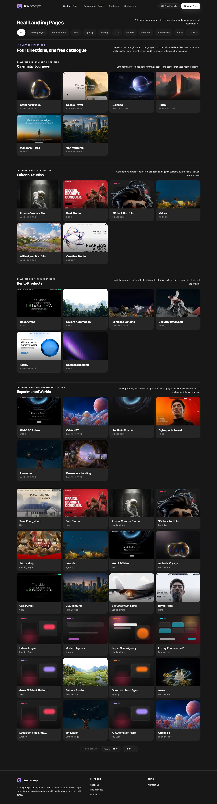

# liro.prompt

Un catálogo de prompts pulido y gratuito para liro.prompt. Convierte el archivo local `liro-prompts` en una aplicación React oscura y centrada en multimedia, con tarjetas de prompts animadas, acciones de copiado, filtros, fondos, degradados y vistas previas en vivo impulsadas por prompts.

> Los prompts reconstruidos son recreaciones prácticas y funcionales basadas en metadatos/medios públicos, no son el texto original de pago de los prompts.

> **Origen de la fuente:** Los registros originales de prompts se obtuvieron del punto final `get-prompt` de MotionSites durante la sesión de investigación capturada. Los registros reconstruidos están claramente marcados como aproximaciones basadas en títulos públicos, categorías y referencias de vista previa. Este catálogo es un proyecto independiente y no afirma ninguna afiliación con MotionSites. Revisa los términos y derechos de activos del producto original antes de redistribuir el archivo o los medios alojados externamente.


## Características

- 253 elementos del catálogo generados desde `liro-prompts`
- Cada elemento es gratuito para inspeccionar, copiar y previsualizar
- Tarjetas de galería animadas centradas en multimedia con respaldo visual
- Filtros por categoría, búsqueda y paginación
- Ruta de vista previa dedicada con etiqueta de fuente, panel lateral de prompt, acción de medio y control de copiado
- Renderizador `/preview/:slug` impulsado por prompts que adapta marca, titular, colores, medios, tarjetas, estadísticas y arquetipo de diseño de cada prompt
- Páginas dedicadas para landing pages, fondos multimedia y degradados CSS generados
- Cobertura de pruebas con Playwright para escritorio y móvil

## Capturas de pantalla

### Catálogo



### Panel lateral de prompt


### Vista previa en vivo


## Tecnologías

- React 18
- Vite
- TypeScript
- Tailwind CSS
- Framer Motion
- lucide-react
- Vitest
- Playwright

## Cómo empezar

```bash
npm install
npm run generate:catalog
npm run dev
```

Abre `http://127.0.0.1:5173`.

## Rutas

- `/` - página principal con secciones de prompts destacados
- `/landing-pages` - catálogo completo de prompts
- `/backgrounds` - galería centrada en multimedia con URLs copiables
- `/gradients` - tarjetas de degradados generados con CSS copiable
- `/preview/:slug` - vista previa en vivo impulsada por prompts para cada elemento del catálogo

## Scripts

```bash
npm run dev
npm run build
npm run preview
npm run lint
npm run test
npm run test:e2e
npm run generate:catalog
```

## Generación del catálogo

Los datos de la aplicación se generan desde el archivo local:

```bash
npm run generate:catalog
```

Lee `liro-prompts/*/metadata.json` y `working-prompt.md`, y luego escribe `src/data/prompts.generated.ts` y `src/data/catalog-summary.json`.

Todos los elementos del catálogo generados se normalizan a `access: "free"`. La interfaz de usuario aún conserva `sourceMode` internamente:

- `original` - texto del prompt obtenido de la sesión de origen
- `reconstructed` - prompt funcional recreado a partir de metadatos públicos de título/categoría/medio

## Nota sobre el extractor

El extractor histórico se conserva en `scripts/extract-liro-prompts.mjs`, pero requiere variables de entorno explícitas y no es necesario para ejecutar la aplicación:

```bash
LIRO_SUPABASE_URL=... LIRO_SUPABASE_ANON_KEY=... node scripts/extract-liro-prompts.mjs
```

## Verificación

La aplicación actual se ha verificado con:

```bash
npm run generate:catalog
npm run lint
npm run test -- --run
npm run build
npm run test:e2e
```
