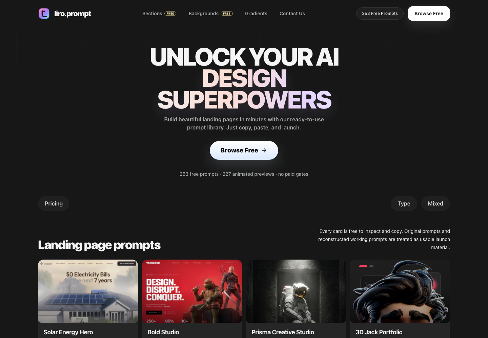
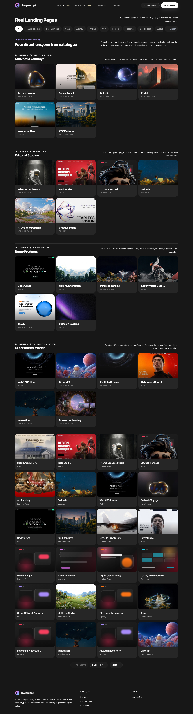
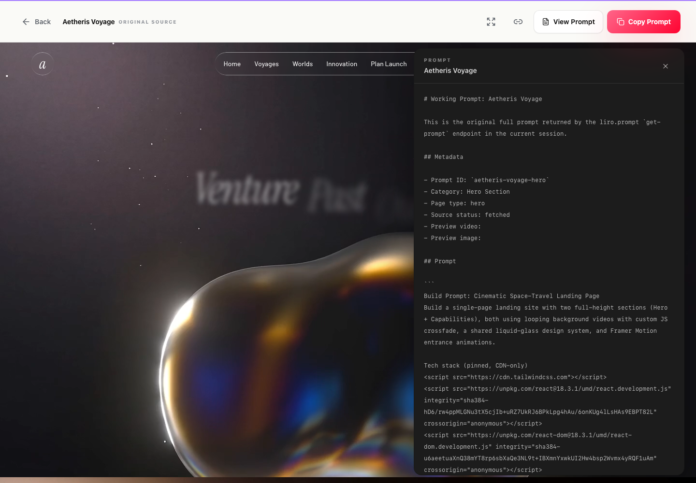
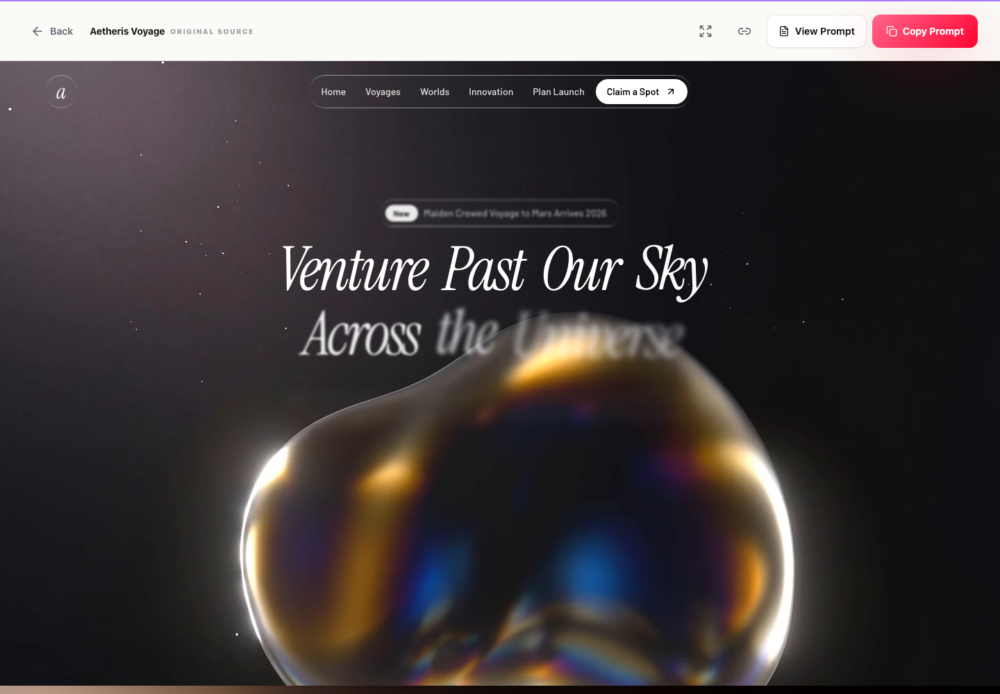

# liro.prompt

A polished, free prompt catalog for liro.prompt. It turns the local `liro-prompts` archive into a dark, media-heavy React app with animated prompt cards, copy actions, filters, backgrounds, gradients, and prompt-driven live previews.

> Reconstructed prompts are practical working recreations from public metadata/media, not original paid prompt text.



## Features

- 253 catalog items generated from `liro-prompts`
- Every item is free to inspect, copy, and preview
- Animated media-first gallery cards with media fallbacks
- Category filters, search, and pagination
- Dedicated preview route with source label, prompt drawer, media action, and copy control
- Prompt-driven `/preview/:slug` renderer that adapts brand, headline, colors, media, cards, stats, and layout archetype from each prompt
- Dedicated pages for landing pages, media backgrounds, and generated CSS gradients
- Desktop and mobile Playwright coverage

## Screenshots

### Catalog



### Prompt Drawer



### Live Preview



## Tech Stack

- React 18
- Vite
- TypeScript
- Tailwind CSS
- Framer Motion
- lucide-react
- Vitest
- Playwright

## Getting Started

```bash
npm install
npm run generate:catalog
npm run dev
```

Open `http://127.0.0.1:5173`.

## Routes

- `/` - homepage with featured prompt sections
- `/landing-pages` - full prompt catalog
- `/backgrounds` - media-first gallery with copyable URLs
- `/gradients` - generated gradient cards with copyable CSS
- `/preview/:slug` - prompt-driven live preview for each catalog item

## Scripts

```bash
npm run dev
npm run build
npm run preview
npm run lint
npm run test
npm run test:e2e
npm run generate:catalog
```

## Catalog Generation

The app data is generated from the local archive:

```bash
npm run generate:catalog
```

This reads `liro-prompts/*/metadata.json` and `working-prompt.md`, then writes `src/data/prompts.generated.ts` and `src/data/catalog-summary.json`.

All generated catalog items are normalized to `access: "free"`. The UI still preserves `sourceMode` internally:

- `original` - prompt text fetched from the source session
- `reconstructed` - working prompt recreated from public title/category/media metadata

## Extractor Note

The historical extractor is kept in `scripts/extract-liro-prompts.mjs`, but it requires explicit environment variables and is not needed to run the app:

```bash
LIRO_SUPABASE_URL=... LIRO_SUPABASE_ANON_KEY=... node scripts/extract-liro-prompts.mjs
```

## Verification

The current app has been verified with:

```bash
npm run generate:catalog
npm run lint
npm run test -- --run
npm run build
npm run test:e2e
```
